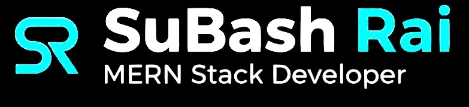
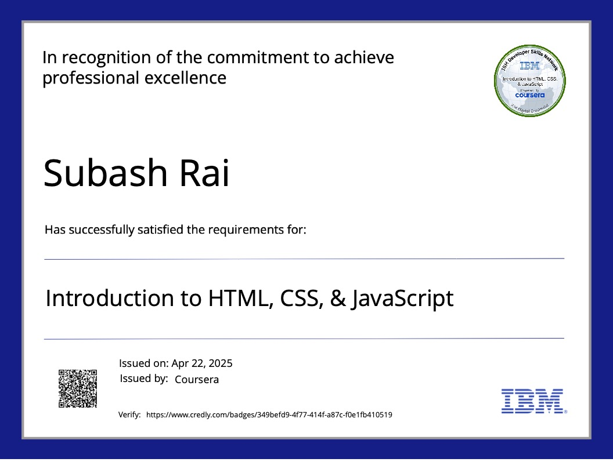
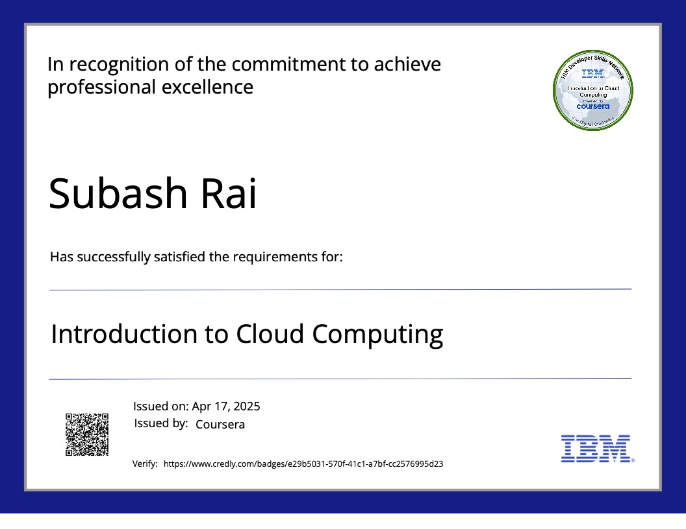
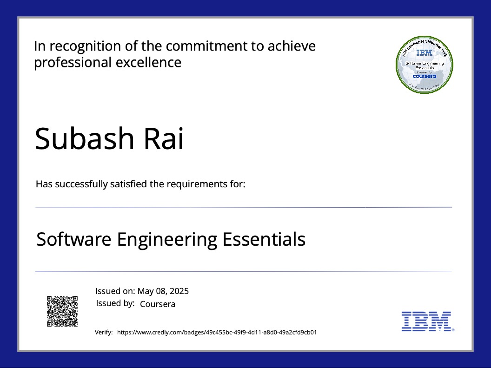
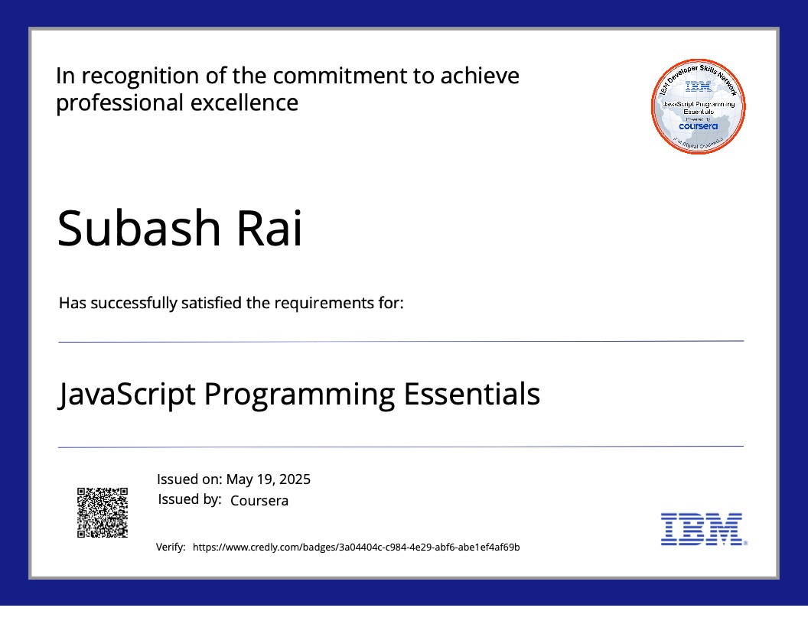
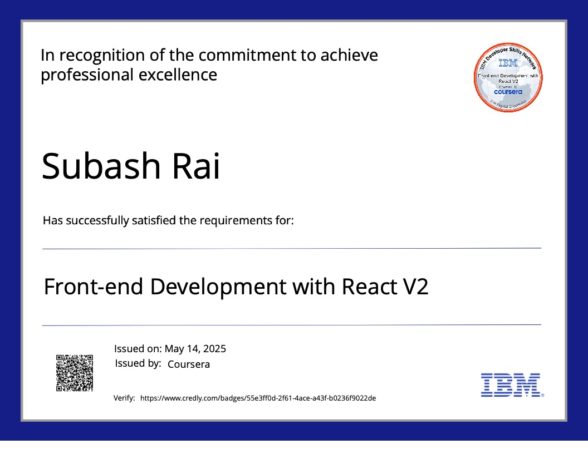
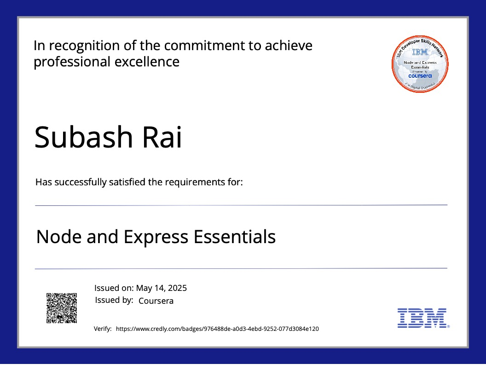
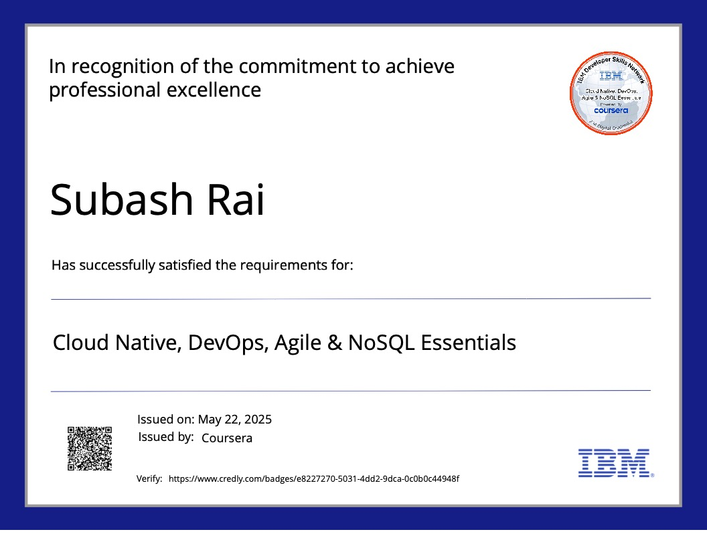

  

<h3 align="center">IBM Certified Full-Stack JavaScript Developer (MERN) | Cloud | CI/CD</h3>

  
  

  
  
  
  
  

---

I'm **Subash Rai**, an **IBM Certified Full-Stack JavaScript Developer** who helps startups and businesses ship **production-ready web apps, mobile apps, and AI-powered SaaS products**.

I specialize in the **MERN stack**—MongoDB, PostgreSQL, Supabase, Firebase, Express, React, Next.js, and Node.js—and build mobile apps with **React Native (Expo)** and **EAS Build** for Android and iOS. From MVP to deployment, I deliver clean code, scalable APIs, polished UIs, and reliable cloud hosting.

**Looking for a developer?** [Email me](mailto:subasbelina255@gmail.com) or [visit my portfolio](https://raisubash.com.np/) to discuss your project.

---

### 💼 Freelance Services

| Service | What You Get |
|--------|--------------|
| **Full-Stack Web Apps** | MERN / Next.js apps with auth, dashboards, admin panels, and REST APIs |
| **AI SaaS Products** | OpenAI & Gemini integration — chatbots, content tools, automation workflows |
| **Mobile Apps** | React Native (Expo) apps for Android & iOS with EAS Build deployment |
| **API Development** | Secure REST APIs, JWT auth, Swagger docs, third-party integrations |
| **UI/UX Implementation** | Responsive interfaces with React, Tailwind CSS, shadcn/ui, and Material UI |
| **DevOps & Deployment** | Docker, Kubernetes, CI/CD pipelines, Vercel, Render, and Netlify setup |

**Typical projects:** SaaS platforms · e-commerce · healthcare portals · admin dashboards · portfolio sites · AI tools

---

### 🤝 Why Work With Me

- ✅ **IBM Certified** Full-Stack JavaScript Developer with verified [Credly badges](https://www.credly.com/users/subash-rai.2708871f/badges#credly)
- ✅ **Live demos** — see real deployed projects below, not just mockups
- ✅ **End-to-end delivery** — frontend, backend, database, and cloud deployment
- ✅ **Remote-friendly** — based in Nepal, available for clients worldwide
- ✅ **Clear communication** — regular updates, clean code, and documented handoff

---

### 🧩 Tech Stack

#### Frontend

**Core**  

**UI & CSS Libraries**  

**State Management**  

**API & Data Fetching**  

#### Mobile

#### Backend

**Core**  

**APIs**  

**AI API Integration**  

#### Database

**NoSQL**  

**SQL**  

**SQLite**  

#### DevOps & Cloud

#### Tools

**Version Control**  

**API & Testing**  

**IDE & Design**  

**Build & Package Managers**  

**Productivity**  

---

### 🌐 Featured Projects

| Project | Highlights | Tech Stack | Live Demo |
|--------|------------|------------|-----------|
| **CVpilotX** | ATS-friendly resume builder with AI content generation, live preview, template switching, and PDF export | React, Node.js, OpenAI API, Tailwind CSS, REST API, Docker, Render | [🌐 Visit](https://cvpilotx-frontend.onrender.com/) |
| **AI Writer SaaS** | AI writing platform with content generation, user auth, subscription flow, and responsive SaaS dashboard | React, Node.js, Express, MongoDB, OpenAI API | [🌐 Visit](https://ai-writer-saas-sepia.vercel.app/) |
| **Telehealth Medical Assistance** | Remote healthcare system with appointments, patient management, secure login, and role-based access | MERN Stack, JWT, REST API, MongoDB | [🌐 Visit](https://telehealth-medical-assistance-syste.vercel.app/) |
| **Cine Mood** | Movie streaming & discovery platform with search, categories, recommendations, and responsive UI | React, REST API, Tailwind CSS | [🌐 Visit](https://cinemood-plum.vercel.app/) |
| **Portfolio Website** | Personal portfolio with dark mode, smooth animations, project showcase, and fully responsive layout | Next.js, Tailwind CSS, TypeScript | [🌐 Visit](https://raisubash.com.np/) |
| **Travel Escape** | Travel discovery platform with destination browsing, trip planning UI, and modern responsive design | React, Tailwind CSS, REST API | [🌐 Visit](https://travel-escape.netlify.app/) |
| **Green Haven** | Eco-friendly e-commerce platform for houseplants with product catalog and modern responsive design | HTML, CSS, JavaScript | [🌐 Visit](https://subashbelina.github.io/green-haven) |
| **E-Commerce MERN App** | Full shopping experience with product catalog, cart, checkout, JWT auth, and admin product management | MERN, JWT, Tailwind CSS, REST API | — |
| **Admin Dashboard** | Analytics dashboard with charts, user roles, reusable UI components, and real-time data visualization | React, Node.js, MongoDB, Chart.js | — |
| **DevOps Pipeline Demo** | Dockerized full-stack app with CI/CD automation, Kubernetes deployment, and cloud-ready workflows | Docker, Kubernetes, GitHub Actions, Nginx | — |

**Key capabilities across projects:** AI API integration · RESTful APIs · JWT authentication · responsive UI · Docker · cloud deployment · production-ready architecture

👉 *These are sample projects I can build for clients — [get in touch](mailto:subasbelina255@gmail.com) to discuss yours.*

---

### 📈 GitHub Stats

  

---

### 🏆 Certifications & Achievements

- ✅ [**IBM Certified Full-Stack JavaScript Developer (MERN)**](https://www.credly.com/users/subash-rai.2708871f)

  
  
  
  
  
  
  
  

👉 [**View all badges on Credly**](https://www.credly.com/users/subash-rai.2708871f/badges#credly)

---

### 🚀 Available For

- 🌐 Full-stack web development (React, Next.js, Node.js, MERN)
- 📱 Cross-platform mobile apps (React Native + Expo)
- 🤖 AI-powered features and SaaS product development
- ☁️ Cloud deployment, Docker, Kubernetes, and CI/CD setup
- 🔧 Bug fixes, feature additions, and project rescue

---

### 📬 Hire Me

  
  
  
  

<strong>Have a project in mind? Send me an email with a brief description — I'll reply within 24 hours.</strong>

---

  

**Thanks for visiting! Have a project? [Let's work together →](mailto:subasbelina255@gmail.com?subject=Freelance%20Project%20Inquiry)**

